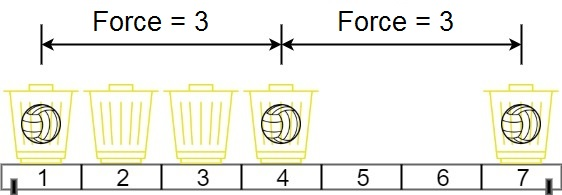

# 1552. Magnetic Force Between Two Balls

## 題目

[link](https://leetcode.com/problems/magnetic-force-between-two-balls/description/?envType=daily-question&envId=2024-06-20)

In the universe Earth C-137, Rick discovered a special form of magnetic force between two balls if they are put in his new invented basket. Rick has n empty baskets, the ith basket is at position[i], Morty has m balls and needs to distribute the balls into the baskets such that the minimum magnetic force between any two balls is maximum.

Rick stated that magnetic force between two different balls at positions x and y is |x - y|.

Given the integer array position and the integer m. Return the required force.

Example 1:



```
Input: position = [1,2,3,4,7], m = 3
Output: 3
Explanation: Distributing the 3 balls into baskets 1, 4 and 7 will make the magnetic force between ball pairs [3, 3, 6]. The minimum magnetic force is 3. We cannot achieve a larger minimum magnetic force than 3.
```

Example 2:

```
Input: position = [5,4,3,2,1,1000000000], m = 2
Output: 999999999
Explanation: We can use baskets 1 and 1000000000.
```

## 解題思路

這題題目有點繞，但簡單講他就是一堆 position 然後規定要放幾顆球 你要找出最大的 gap 可以滿足

我們先把 position 做排序

接著建立一個 canPutBalls，canPutBalls 可以接受一個 input gap，透過這個 function 我們可以判斷這個 gap 是否可以放超過ｍ顆球

最後透過 binary search 去找到可以符合的最大值

```js
/**
 * @param {number[]} position
 * @param {number} m
 * @return {number}
 */
const maxDistance = (position, m) => {
  position.sort((a, b) => a - b);

  const canPutBalls = (gap) => {
    let ball = 1;
    let currentPosition = position[0];
    for (let p of position) {
      if (p - currentPosition >= gap) {
        currentPosition = p;
        ball++;
      }

      if (ball >= m) return true;
    }
    return false;
  };

  let left = 0;
  let right = position[position.length - 1];

  while (left < right - 1) {
    let mid = Math.floor((left + right) / 2);
    if (canPutBalls(mid)) {
      left = mid;
      continue;
    }

    right = mid--;
  }
  return left;
};
```

時間複雜度: 大約 O(n log n)

- js sort 演算法為 O(n log n)
- binary search 大約 O(log n)
- canPutBalls 大約 O(n)
- 在 binary search 裡面呼叫 canPut Ball 大約 O(n log n)
